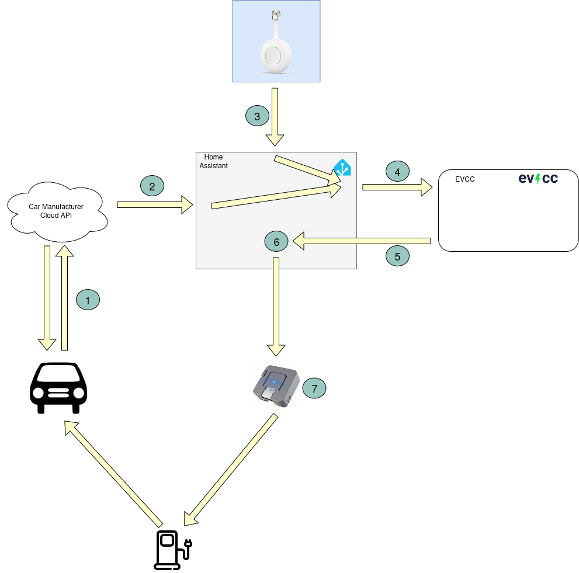

## fake-xemex-csmb

A Modbus client that emulates a Xemex CSMB by simulating a Modbus-RTU server, designed for the M5Stack ATOM Lite ESP32.

## Project Purpose

This project enables you to control the charging speed of a Shell Recharge Advanced 3.0 charging station by emulating a Xemex CSMB device.

## How It Works

An ESPHome device acts as a Xemex CSMB by simulating a Modbus RTU slave/server. It can be polled by a master device (such as a Shell Recharge Advanced 3.0 EV wallbox) and provides IREGs and HREGs that can be set as needed. This setup is managed using [Home Assistant](https://www.home-assistant.io/) and [EVCC](https://evcc.io/en/), with EVCC installed as an add-on in Home Assistant.

1. fds
